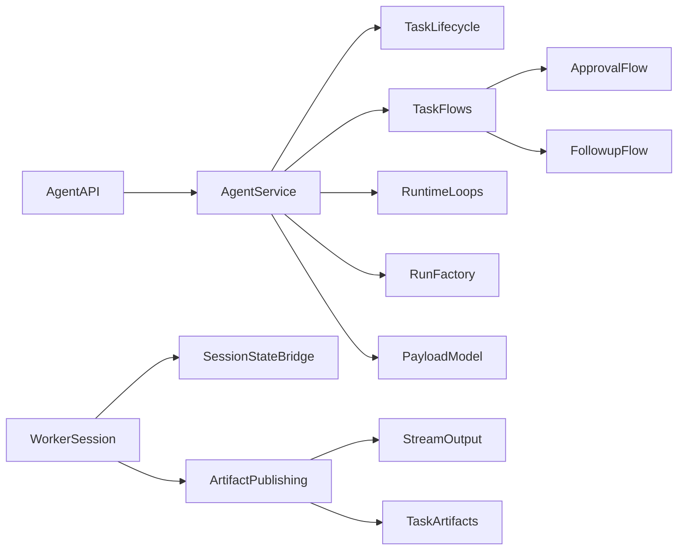

# Orchestration

## Purpose

This document is the living map of Airstore's orchestration system. It should
answer three questions quickly:

1. What is the top-level boundary?
2. What are the main subflows beneath it?
3. Where does each concept live in code?

The top-level orchestration boundary is the `Task`.

- A `Task` owns lifecycle state, current run binding, and whether human input
  is needed.
- Beneath `Task`, there are two human-input subflows:
- `ApprovalFlow`: structured decisions over pending artifacts and blockers.
- `FollowupFlow`: free-text input that wakes or resumes the active run.

## System Shape

## Module Map

- `pkg/orchestration/agent_api.go`
  The public orchestration facade used by transport layers. Query and admin
  entrypoints now live directly here instead of behind extra wrapper services.
- `pkg/orchestration/service.go`
  The composition root that wires task lifecycle, task flows, runtime loops,
  and run materialization together.
- `pkg/orchestration/task_lifecycle.go`
  The task state authority.
- `pkg/orchestration/task_flows.go`
  The `ApprovalFlow` and `FollowupFlow` home: task commands, human input
  delivery, pending sweeps, and wake-or-requeue behavior.
- `pkg/orchestration/runtime.go`
  Dispatch, outbox publishing, and result projection loops.
- `pkg/orchestration/run_factory.go`
  Run materialization and resume/session-barrier coordination.
- `pkg/orchestration/payload_model.go`
  Durable payload parsing and serialization for orchestration envelopes.
- `pkg/types/task_output.go`
  The `TaskArtifacts` model: persisted task outputs, artifact metadata,
  blocking metadata, blocker payloads, and related helpers now live together.
- `pkg/types/`
  Core persisted orchestration types outside the task-artifact model.
- `pkg/worker/interactive_task.go`
  The interactive worker session coordinator. It now also owns the
  `SessionStateBridge`, follow-up waiting, subagent watching, and approval
  summary extraction.
- `pkg/worker/artifact_publishing.go`
  The `ArtifactPublishing` home: worker-side artifact candidates, metadata
  normalization, dedup/tracking, approval artifact plans, and persistence.
- `pkg/worker/output.go`
  Stream output fanout plus structured task-output tracking. The transient
  stdout/stderr writer is named `TaskStreamOutput` to distinguish it from
  persisted `TaskArtifacts`.

## Task Boundary

The orchestration layer should be understandable in terms of a single `Task`
boundary.

`Task` owns:

- lifecycle state such as queued, running, waiting, sleeping, done, dropped
- the current run binding
- the current blocker, if any
- the input mode currently required from a human

`Task` does not own execution details. Those belong to `Run`, `Attempt`, and
`RunExecution`.

## ApprovalFlow

`ApprovalFlow` is the structured decision path under `Task`.

It includes:

- blocker creation and resolution
- pending artifact selection
- approval/reject decisions
- supersession or activation of affected artifacts
- wait-group semantics for approval batches

## FollowupFlow

`FollowupFlow` is the free-text input path under `Task`.

It includes:

- durable user input storage
- waking the active execution when possible
- requeueing for resume when no live execution can consume the input
- preserving the task session timeline across resumed runs

## Sequence: Queue To Settle

1. A task is accepted and queued.
2. Dispatch materializes a run and attempt execution.
3. The worker executes the run.
4. The worker either completes, waits for input, or schedules wake behavior.
5. Result projection finalizes the run outcome.
6. Task lifecycle settles the task state.

## Sequence: Approval

1. The worker identifies approval-required output.
2. Task artifacts are persisted with approval metadata.
3. The task transitions to waiting with a blocker.
4. A human approves, rejects, or sends free-text follow-up.
5. The task input flow updates artifacts and resumes or requeues execution.

## Glossary

- `Task`: orchestration boundary
- `Run`: logical execution session for a task
- `Attempt`: one orchestrated try for a run
- `RunExecution`: concrete worker execution payload
- `TaskArtifacts`: persisted task outputs and blocker-linked artifacts
- `TaskArtifacts` currently live in `pkg/types/task_output.go`
- `ArtifactPublishing`: worker-side pipeline that persists task artifacts
- `StreamOutput`: worker-side stdout/stderr fanout and structured output
  tracking before persistence
- `SessionStateBridge`: worker-side bridge that reflects interactive session
  state back into orchestration
- `ApprovalFlow`: structured blocker and approval path
- `FollowupFlow`: free-text follow-up and resume path
